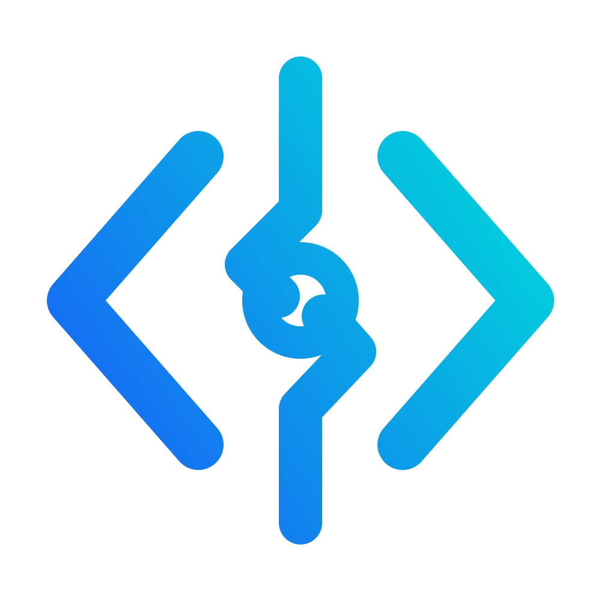

<p align="center">
  
</p>

# Codex Live Viewer — Control Panel Edition

A live dashboard **and control panel** for every [OpenAI Codex CLI](https://github.com/openai/codex) session on your machine — bundled with our own fork of the `codex` Claude Code plugin, so handoffs can be started, watched, resumed, and cancelled from the browser.

## Why this exists

We use Fable to plan and coordinate work. Its plugin hands implementation tasks to Codex, and Codex does the coding in a headless app-server session.

Those handoffs do not open a terminal or window. We built this viewer to know whether Codex was still working, had finished, or had become stuck — and then grew it into a full control panel because watching a stuck job without being able to fix it is only half the story.

Codex writes its session events to `~/.codex/sessions/YYYY/MM/DD/rollout-*.jsonl`. The viewer follows those files and streams activity to the browser. The bundled plugin additionally records ground-truth job state (exact PID, heartbeat, failure cause) at `~/.codex-companion/state`, shared between the `/codex:*` Claude Code commands and the web UI.

 

## Features

- Filesystem watching sends new events to the browser through SSE. A one-second poll is there as a fallback.
- The session list shows the first user prompt as its title and sorts sessions into LIVE, IDLE, STALE, DONE, and ALL.
- The feed separates user messages, agent messages, working output, and status changes.
- Sessions you are not watching get an unread dot when something changes.
- The feed includes prompts, shell commands, command output, patches, reasoning summaries, agent messages, and completion events.
- The newest live session opens automatically until you choose a session yourself.
- The task menu copies ready-to-paste `codex resume`, `codex exec resume` (headless continue), and `codex fork` commands for the selected session.
- Sessions archived with `codex archive` appear under an Archived filter with a copy-paste `codex unarchive <id>` command to restore them.
- Waiting and possibly-stuck sessions explain what they were last doing (running a command, thinking, waiting for a reply) and for how long.
- The responsive dashboard includes search, human-readable status filters, Activity and Raw log views, a collapsible and resizable session list, and a safer task-actions menu.
- Search covers ALL recorded sessions, not just the visible list: a metadata index (title, project, thread id) of every rollout file powers a History section, and clicking a result loads that session on demand.
- Layout and display preferences are saved in the browser, including sidebar width, selected filter, feed view, auto-follow, and auto-scroll.
- On Windows, you can inspect matching Codex processes and stop a stuck task through a detail dialog that shows the full command line and warns before touching shared `app-server`/MCP processes.
- A small Rust tray app starts the Node viewer in the background on Windows and Linux.
- The tray shows a native notification when a Codex task finishes.
- The Node viewer itself has no npm dependencies.

### Control panel (bundled plugin)

- **Start handoffs from the browser**: New task form with project directory, prompt, effort (none→xhigh), model, write access, and sandbox override. One code path with the CLI — `/codex:status` in Claude Code and the JOBS tab always show the same jobs.
- **Reviews from the browser**: run `review` or `adversarial-review` against any project's working tree; findings render in the UI and stay on disk for `/codex:result`.
- **Fast mode**: opt in per task, review, or resume for priority processing; fast jobs are marked in the JOBS tab and normal mode remains the default.
- **Ground-truth stuck detection**: jobs are classified **RUNNING** (heartbeat fresh or process alive on a long task), **QUIET — process alive** (heartbeat stale past 5 min), or **DEAD — resumable** (process gone). Long-running commands are never misflagged: liveness is checked against the real PID, not just file quiet-time.
- **Death reasons**: when a job dies, the UI shows *why* — including the Windows sandbox `1312` cluster, expired Codex auth, and rate limits — with a fix hint.
- **One-click resume**: dead jobs (and stale sessions with a thread id) get a Resume button — optionally with a different effort, model, or write access. Refuses to resume while the job's process is still alive; recovery is always flag-only, never automatic.
- **Cancel** running jobs (turn interrupt + process-tree kill via the companion), **instant completion pushes** from the companion to the UI, and per-session **effort / sandbox / token** display parsed from the rollouts.

## Install as a Claude Code plugin

This repo IS a Claude Code marketplace. In Claude Code:

```
/plugin marketplace add Fundryi/codex-live-viewer
/plugin install codex@fundryi
```

(Working from a local clone instead? `/plugin marketplace add <path-to-clone>` works the same.)

The installed plugin bundles the viewer and starts it automatically on each Claude Code session start. Set `CODEX_VIEWER_AUTOSTART=0` to opt out. Autostart leaves the browser closed; run `/codex:viewer` to start or reuse the viewer and open its dashboard.

The plugin checks for updates once a day at session start and prints the update command when a newer version is available. Set `CODEX_PLUGIN_UPDATE_CHECK=0` to disable the check.

Fast mode is opt-in per job, uses `service_tier=priority` and more quota, and can use a different tier value through `CODEX_PLUGIN_FAST_TIER`.

Uninstall the OpenAI-marketplace copy of `codex` first so `/codex:*` resolves to ours. All command names stay identical (`/codex:rescue`, `/codex:review`, `/codex:status`, ...). What our fork changes:

- **Sandbox**: defaults to `danger-full-access` (see [Sandbox](#sandbox) below) instead of the broken-on-Store-pwsh sandboxed modes — and it survives plugin updates, because the plugin is this repo.
- **Reliability**: job records carry a heartbeat, exact PID, thread id from the first event, and a mapped death reason; the companion pushes completions to the viewer.
- **`task --resume-thread <id>`** and background reviews, powering the web UI's resume/review buttons.

### Sandbox

`CODEX_PLUGIN_SANDBOX` controls the sandbox for all plugin/viewer-launched runs. Default: `danger-full-access`, because the Microsoft Store `pwsh.exe` stub cannot be spawned by Codex's sandbox users (`CreateProcessAsUserW failed: 1312` / `CreateProcessWithLogonW failed: 2`). If you install MSI PowerShell and disable the `pwsh` app-execution alias, flip it back with `CODEX_PLUGIN_SANDBOX=workspace-write` — no code change needed.

### Upstream syncs

`node scripts/upstream-diff.mjs` clones the latest [openai/codex-plugin-cc](https://github.com/openai/codex-plugin-cc) and prints a diff against `plugin/` (`--full` for the complete diff). Cherry-pick what's good by hand; updates are opt-in, never automatic.

## Quick start

Requires [Node.js 18+](https://nodejs.org).

### Windows

Download and extract `Codex-Live-Viewer-Windows-x64.zip`, then double-click `Codex Live Viewer.exe`. The app starts in the system tray without opening a terminal. Double-click the tray icon to open the viewer, or right-click it for status, `Open viewer`, `Restart viewer`, and `Exit`.

The tray checks its Node child once per second. If the background server exits, the icon turns red, the menu shows `Status: Stopped`, and a native notification points to `Restart viewer`. A successful restart restores the blue icon and dashboard without restarting the tray app.

### Linux desktop

Download and extract `Codex-Live-Viewer-Linux-x64.zip`, then run:

```sh
./codex-live-viewer-tray
```

The Linux tray requires GTK 3 and Ayatana AppIndicator (for example `libgtk-3-0` and `libayatana-appindicator3-1` on Ubuntu/Debian).

### macOS

There is no macOS tray build. The bundled Claude Code plugin autostarts the Node viewer on session start; run `/codex:viewer` to open it.

### Node CLI

```sh
node codex-live-viewer.js serve    # foreground (what npm start does)
node codex-live-viewer.js start    # detached background + open browser
node codex-live-viewer.js stop     # stop the background server
node codex-live-viewer.js status
```

## Remote access

By default the viewer only listens on `127.0.0.1`. Three ways to open it up:

### Home LAN

    node codex-live-viewer.js serve --host 0.0.0.0

Open `http://<server-ip>:8377` from any machine on your network. No auth — your LAN is trusted.

### Internet, zero setup (Cloudflare quick tunnel)

Install [cloudflared](https://developers.cloudflare.com/cloudflare-one/connections/connect-networks/downloads/), then:

    node codex-live-viewer.js serve --tunnel

The viewer prints a ready-to-click `https://<random>.trycloudflare.com/?token=...` URL. Free, no Cloudflare account, new URL each start. Tunnel visitors need the token (auto-generated once, stored in `~/.codex/live-viewer-token`); local/LAN access stays tokenless.

### Internet, custom domain (named tunnel)

Create a named tunnel in the [Cloudflare Zero Trust dashboard](https://one.dash.cloudflare.com/) pointing at `http://localhost:8377`, copy its token, then:

    node codex-live-viewer.js serve --tunnel-token <TUNNEL_TOKEN>

Stable URL on your own domain. Access token works the same as above.

Pin a fixed access token with `--token <secret>` or `CODEX_VIEWER_TOKEN` instead of the auto-generated one.

### Build from source

Requires stable Rust and Node.js 18+:

```sh
npm run tray          # development build
npm run build:tray    # optimized launcher
```

The tray launcher must remain beside `codex-live-viewer.js` in a release folder. The Node CLI can also run independently without Rust.

## Releases

Pushing a version tag such as `v1.0.0` builds the Windows and Linux launchers and creates a GitHub Release with ready-to-use ZIP files.

## Configuration

| Environment variable | Default | Purpose |
|---|---|---|
| `CODEX_VIEWER_PORT` | `8377` | HTTP port (also the target of companion completion pushes) |
| `CODEX_HOME` | `~/.codex` | Codex home (sessions are read from `$CODEX_HOME/sessions`) |
| `CODEX_PLUGIN_SANDBOX` | `danger-full-access` | Sandbox mode for plugin/viewer-launched Codex runs |
| `CODEX_COMPANION_STATE_ROOT` | `~/.codex-companion/state` | Shared job state (plugin CLI + viewer) |
| `CODEX_VIEWER_TRAY_PORT` | viewer port + 1 | Tray single-instance lock port |
| `CODEX_VIEWER_NOTIFICATIONS` | `1` | Set to `0` to disable tray notifications |

## Optional: completion toasts (Windows)

The tray already shows completion notifications while it is running. The viewer and tray work without changing your Codex configuration.

Run `install-codex-notify-hook.bat` if you also want notifications when the viewer is closed. The hook uses [BurntToast](https://github.com/Windos/BurntToast) when it is available and writes each completion to `~/.codex/hooks/notify-log.jsonl`.

The installer keeps the notifier that was already configured and calls it after writing its own notification. It backs up `config.toml`, changes only the `notify` line, verifies the result, and restores the backup if verification fails. You can run it again after a Codex Desktop update changes the notifier path.

When the tray is connected, the hook keeps logging and calling the original notifier but suppresses its own toast. This prevents duplicate notifications. The viewer does not need the hook for normal operation.

## Recovering a stuck session

1. Check the JOBS tab: plugin-launched jobs show ground truth — **RUNNING** (heartbeat fresh), **QUIET — process alive** (no heartbeat for 5+ min; might be wedged, might be a long silent command), or **DEAD — resumable** (process gone), plus the death reason when one was captured.
2. For a dead job, click **Resume** — optionally with a higher effort or a different model — and confirm. The viewer refuses while the job's process is still alive; stop it first via the stop dialog (which warns before touching shared `app-server`/MCP hosts).
3. Sessions started outside the plugin (plain `codex` runs) keep the heuristic classification and the copy-paste actions: `Copy continue command` (`codex exec resume <id> "…"`), `Copy resume command` (interactive), `Copy fork command` (experiment on a copy).
4. Don't want to continue it at all? `Dismiss task` hides the dead session from every filter except All (viewer-only, stored in your browser, undoable via `Restore task`). For permanent cleanup, `Copy archive command` gives you `codex archive <id>` — archived sessions stay visible under the **Archived** filter with a `codex unarchive <id>` command to restore.

Recovery is always flag-only: the viewer marks, you click. It never auto-resumes or auto-kills.

## Security notes

- The server listens on `127.0.0.1` by default, so it is not exposed to the network.
- The viewer never edits Codex session files or `~/.codex`. It spawns Codex only through the bundled companion script, and only when you submit an in-app form or confirm an action dialog.
- All state-changing endpoints (`/task`, `/review`, `/resume`, `/cancel`, `/kill`, `/shutdown`) are POST-only and reject untrusted browser origins and DNS-rebound Hosts.
- The Windows stop feature runs `taskkill` only after you choose a PID and confirm it in a dialog that shows the full command line. Plugin-launched jobs use the exact recorded PID; for foreign sessions the match is start-time based and the dialog warns explicitly before stopping `codex app-server`/MCP processes that may host several handoffs.

## Limitations

- The tray launcher supports Windows and Linux. The Node server and CLI also run on macOS, but there is no macOS tray build yet.
- `Exit` stops Node only when that tray instance started it. If Node was already running, the tray leaves it alone.
- Sessions are detected by file growth. A session whose file stops growing for 20 s shows as IDLE even if the process is still alive (e.g. long-running silent tool call).
- Search matches session metadata (title, project, thread id) — not the full conversation text.
- The rollout schema is not a public API. The parser is schema-tolerant and skips unknown shapes silently; if an event type renders as a gap, extend `simplify()` in `codex-live-viewer.js`.

## Project layout

- `codex-live-viewer.js`: Node server, CLI, rollout parser, control endpoints, and embedded fallback UI
- `viewer-ui.html`: zero-dependency responsive browser interface
- `plugin/`: our fork of the `codex` Claude Code plugin (companion script, commands, hooks)
- `.claude-plugin/marketplace.json`: makes this repo an installable Claude Code marketplace
- `scripts/upstream-diff.mjs`: selective upstream sync helper
- `docs/UI-THEME.md`: visual system and interaction rules
- `tests/`: Node regression tests (server, UI, and plugin)
- `tray-launcher/`: Windows and Linux tray app
- `install-codex-notify-hook.bat`: optional Windows completion notifications
- `.github/workflows/release.yml`: builds release ZIPs when a `v*` tag is pushed

## License

MIT for the viewer, tray, and scripts. `plugin/` is a fork of [openai/codex-plugin-cc](https://github.com/openai/codex-plugin-cc) and keeps its original Apache-2.0 license and NOTICE.
