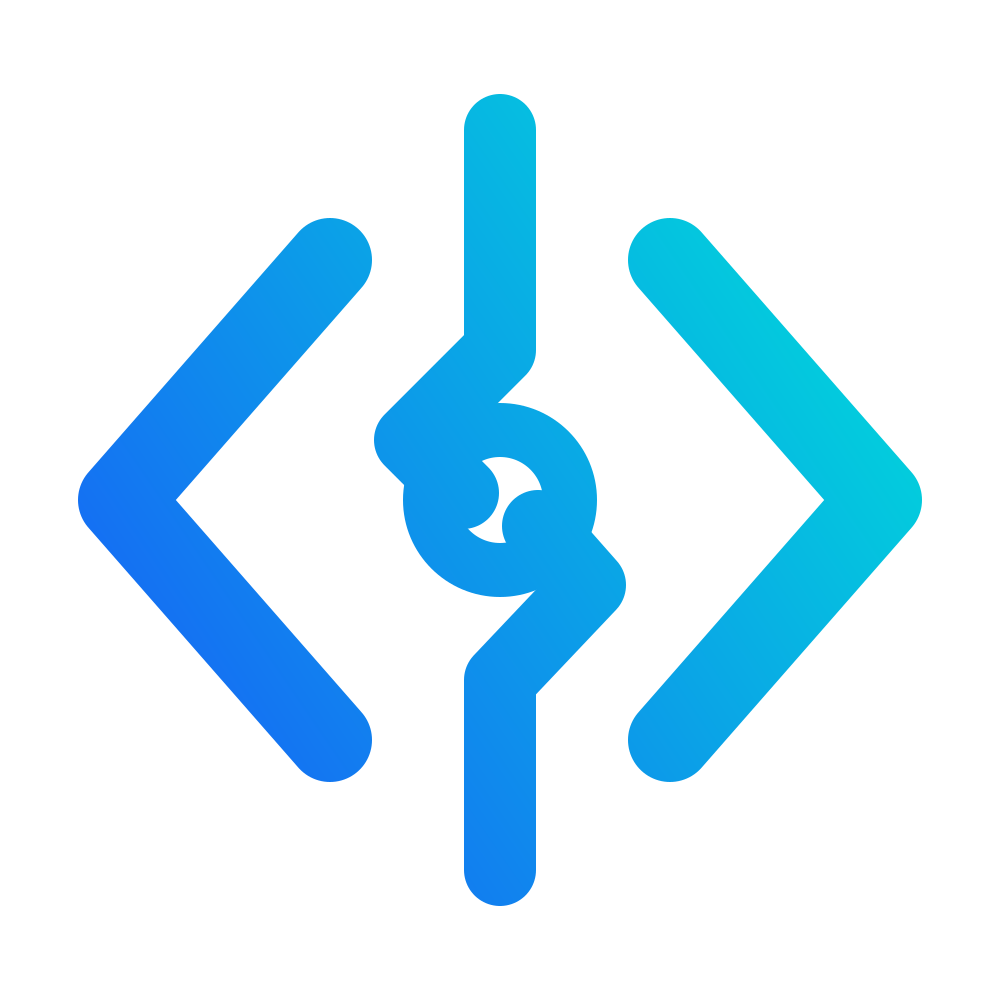

<p align="center">
  
</p>

<h1 align="center">Claude Codex Handoff</h1>

<p align="center">
  Hand coding tasks from <a href="https://claude.com/claude-code">Claude Code</a> to the <a href="https://github.com/openai/codex">OpenAI Codex CLI</a> without losing them.<br>
  A reliability-first fork of the official <code>codex</code> plugin, plus a live dashboard to watch, resume, and cancel runs.
</p>

<p align="center">
  
  = 22">
  
</p>

---

> [!WARNING]
> **Codex runs with full access by default.** Runs launched by this plugin use `danger-full-access`: Codex can read and write anywhere and run any command, as your user. This is deliberate. The sandboxed modes are broken on common Windows setups (Store PowerShell stub, error `1312`) and were a constant source of dead handoffs. Sandbox works on your machine? Set `CODEX_PLUGIN_SANDBOX=workspace-write` to get it back. Either way: only use this on machines you trust with the code you run.

## Install

```
/plugin marketplace add Fundryi/claude-codex-handoff
/plugin install codex@fundryi
```

Needs [Node.js](https://nodejs.org) 22+ and the Codex CLI (`npm install -g @openai/codex`, then `codex login`). Had the OpenAI-marketplace `codex` plugin? Uninstall it first; every `/codex:*` command name stays the same.

From your next Claude Code session on:

- the **dashboard starts itself** in the background (open it with `/codex:viewer`)
- the plugin **checks for updates** once a day and prints the update command when there is one

## Why this exists

Handoffs to Codex run headless: no terminal, no window. When one silently died or hung, you found out an hour later, and there was no way to see why or continue it. This project makes the whole thing observable and recoverable.

## Never lose a job again

The dashboard classifies every job from ground truth (real PID + heartbeat), not from guessing at quiet log files:

| Status | Means | You do |
|---|---|---|
| Running | Heartbeat fresh, or the process is alive on a long command | Nothing. Long tasks are never misflagged. |
| Needs attention | Process gone before finishing, its heartbeat stopped, or it failed with a known cause | Click **Resume**, optionally with more effort or another model, or read the fix hint (broken sandbox, expired `codex login`, rate limit). |
| Needs answer | The finished job asked a question | Answer it in the result card; "Answer and resume" continues the same thread after a confirm. |
| Stopped | Cancelled job or aborted turn | Nothing. Not an alarm. |
| Finished | Completion event received | Read the result card: Summary, Changed files, Checks run. |

Recovery is always flag-only: the dashboard marks, you click. It never resumes or kills anything on its own. Job workers are detached and the SessionEnd hook leaves them alone, so restarting Claude Code, or sending a new message under a host like CloudCLI that ends the session per turn, doesn't kill your handoffs. The next prompt brings back a short result for each finished job: its Summary, any question Codex asks, and the job id for the full text.

On CloudCLI, where Claude always runs in one folder, `/codex:handoff --cwd <folder>` targets another project and its result still comes back to Claude's folder. Two limits: a resume started from the viewer is not reported through Claude's prompt hook (only a session in the job's own folder sees it), and `/codex:status` with no job id shows only the current folder's jobs (pass the id to see a `--cwd` job).

## What you get

**In Claude Code:**

| Command | Does |
|---|---|
| `/codex:handoff` | Hand a task to Codex as a background job (`/codex:rescue` is the same command under its original name) |
| `/codex:review` / `/codex:adversarial-review` | Codex reviews your working tree, or challenges your design |
| `/codex:status` / `/codex:result` / `/codex:cancel` | Track, fetch, or stop jobs |
| `/codex:transfer` | Move the current Claude session into a Codex thread |
| `/codex:viewer [restart\|stop\|kill\|status]` | Open the dashboard (starts it, and replaces one left running by an older version); `restart`, `stop`, force-quit (`kill`) or `status` it |
| `/codex:setup` | Check Codex CLI readiness |

**Effort and fast mode** are set per job (the Resume form in the dashboard, `--effort`/`--fast` on the CLI, or just say "high effort" / "use fast mode" in a handoff request):

| Effort | Use for |
|---|---|
| `low` | Trivial one-liners, mechanical renames, boilerplate |
| `medium` | Quick tweaks; simple browser-testing checklists |
| `high` | Browser testing and live verification runs, larger mechanical work |
| `xhigh` | The everyday default: bugfixes, features, reviews, designs, root-cause hunts |
| `max` | The hardest problems (GPT-6, GPT-5.6, and Daybreak models) |
| `ultra` | Max reasoning plus automatic task delegation (`gpt-6-astra`, `gpt-6-sol`, `gpt-5.6-sol`, `gpt-5.6-terra`, `gpt-daybreak-blue-latest`) |

When in doubt, go one tier up. A smarter run costs a little more time and quota; a dumber run costs a redo. If you set no effort, the plugin applies `xhigh` instead of Codex's own low default. `max` and `ultra` are never applied on their own; ask for them.

**Model shortcuts:** `--model astra`, `sol`, `terra`, `luna`, and `daybreak-blue` expand to `gpt-6-astra`, `gpt-6-sol`, `gpt-5.6-terra`, `gpt-6-luna`, and `gpt-daybreak-blue-latest`. There is no GPT-6 Terra, so `terra` stays on GPT-5.6. Pass a full name such as `gpt-5.6-sol` to pick an older model. Leave the model unset to get the default from your Codex config (`gpt-6-astra` on a fresh install). `astra` is GPT-6 Astra, the top model in the Codex catalog. `max` works on every GPT-6, GPT-5.6, and Daybreak model, but not on `gpt-5.5`. `ultra` needs `astra`, `sol`, `terra`, `daybreak-blue`, or `gpt-5.6-sol`. The Luna models stop at `max`.

`daybreak-blue` is Daybreak Blue, the security-specialty model: sol-class reasoning with fewer restrictions on defensive security analysis. Use it for security reviews, audits, vulnerability hunting, and reversing work. Daybreak access is verification-gated per account, so the plugin checks availability before starting a Daybreak run; without access the run fails immediately with a clear message instead of an opaque API error.

`--fast` is orthogonal: it buys priority processing (faster turnaround, more quota) at whatever effort you chose, and never changes the effort tier. Use it when you are actively waiting on the result; it is always opt-in, never the default.

**In the browser** (`localhost:8377`):

- every Codex session on the machine, streaming live, however it was started, in one list with three tabs (Now, Handoffs, History) and filter chips instead of separate session/job views
- a feed that shows who says what: your messages, Claude's handoff prompts and automatic answers, the plugin's return format, Codex's replies and questions, and Codex's work (thinking, commands, patches) in its own collapsed log, each actor in one color with a legend
- a result card on every finished handoff (Summary, Changed files, Checks run, Needs decision) with an answer box that resumes the thread when Codex asked a question; "Show full result" opens the full result dialog and lists every run on the thread, newest first
- one-click resume and cancel, with in-app confirmation
- one job store shared with the CLI, so `/codex:status` and the dashboard always agree
- search across all recorded sessions, effort/sandbox/token display, archived sessions, unread markers, saved layout

## Using it well

Patterns from daily use that make handoffs reliable:

1. **Write a contract, not an essay.** Keep short per-task-type instruction files in your repo and open every prompt with the line `Follow handoff/coding.md (binding).` on its own, then the task as `<goal>`, `<rules>`, `<done_when>` and `<files>`. A ready-to-copy set ships in [`handoff/`](handoff/): copy the folder, fill in the `ADAPT:` markers, done. The plugin spots contract files and names the right one automatically.
2. **Scope limits writes, not reads.** Codex may read anything to trace the real flow; name the files it may change.
3. **Demand a self-check gate.** End your contract with checks Codex runs before returning. Every bug a review catches becomes a permanent check, so quality compounds.
4. **Fix a return format.** Uniform returns (findings, diff, manifest, gate results) are reviewable at a glance. The plugin ends every task with Summary, Changed files, Checks run and Needs decision; your contract's sections come before those.
5. **Match effort to the task, and round up.** `xhigh` for everything that involves judgment; `medium`/`high` fit verification runs like browser testing, where the checklist does the thinking. `--fast` only when you're actively waiting.
6. **Let the dashboard carry the anxiety.** Kick off jobs, keep working, act when a badge asks you to.

<details>
<summary><b>Standalone dashboard</b> (no plugin needed)</summary>

The dashboard runs on its own and only reads `~/.codex/sessions/`:

```sh
node codex-live-viewer.js start    # background + open browser (add --no-open to skip the tab)
node codex-live-viewer.js serve    # foreground
node codex-live-viewer.js stop
node codex-live-viewer.js restart  # stop whatever viewer runs, start this one
node codex-live-viewer.js status   # running or not, and its version
node codex-live-viewer.js kill     # force-quit, also a hung viewer
```

`start` replaces a viewer left running by an older version, so after an update it brings up the new one.

**Port and address.** The viewer listens on `127.0.0.1:8377`. The port is fixed on purpose: the plugin finds the viewer by it to report finished jobs. If another program already uses 8377, the viewer does not start and says so; set `CODEX_VIEWER_PORT` to a free port where Claude and Codex run. Under WSL, `localhost:8377` on Windows reaches a viewer running inside WSL, and it shows the Codex runs from the WSL side. In a Docker container, set `CODEX_VIEWER_HOST=0.0.0.0` and publish the port to the host only, for example `-p 127.0.0.1:8377:8377`.

Or grab a tray app from [Releases](../../releases): `Codex-Live-Viewer-Windows-x64.zip` (double-click the exe) or `Codex-Live-Viewer-Linux-x64.zip` (needs GTK 3 + Ayatana AppIndicator). The tray supervises the server and shows completion toasts. No macOS tray; use the Node CLI or the plugin's autostart.

Remote access: `--host 0.0.0.0` (or `CODEX_VIEWER_HOST=0.0.0.0`, which the plugin's autostart also uses) for your LAN, with no token, so anyone on that network can use it; `--tunnel` for a free Cloudflare quick tunnel (token-gated, URL printed on start), `--tunnel-token <t>` for a named tunnel on your own domain. Local access never needs a token.

Behind a reverse proxy (Nginx Proxy Manager, Caddy, Traefik): set `CODEX_VIEWER_ALLOWED_HOSTS` to the name you open in the browser, for example `viewer.example.com`. Put it in the `env` block of `~/.claude/settings.json` on the machine that runs the viewer, so the autostart uses it too. That one setting also makes the viewer listen on all addresses, because the proxy usually runs on another machine. If the proxy runs on the same machine, also set `CODEX_VIEWER_HOST=127.0.0.1`. Without the name, the page loads but every control is refused, and the header says "Controls blocked at this address". The proxy needs no special settings: the viewer sends a keep-alive line every 25 seconds, so live updates do not time out. Like LAN access, there is no token, so protect the proxy name if others can reach it.

</details>

<details>
<summary><b>Configuration</b> (environment variables)</summary>

| Variable | Default | Purpose |
|---|---|---|
| `CODEX_PLUGIN_SANDBOX` | `danger-full-access` | Sandbox for plugin/dashboard-launched runs (see warning above) |
| `CODEX_PLUGIN_FAST_TIER` | `priority` | Service tier used by `--fast` |
| `CODEX_PLUGIN_UPDATE_CHECK` | `1` | `0` disables the daily update check |
| `CODEX_VIEWER_AUTOSTART` | `1` | `0` disables the session-start dashboard autostart |
| `CODEX_VIEWER_PORT` | `8377` | Dashboard port (also receives job-completion pushes) |
| `CODEX_VIEWER_HOST` | `127.0.0.1` | Bind address; `0.0.0.0` opens it to your LAN |
| `CODEX_VIEWER_ALLOWED_HOSTS` | (none) | Comma list of names a reverse proxy serves the dashboard under; when set, the default bind becomes `0.0.0.0` |
| `CODEX_COMPANION_STATE_ROOT` | `~/.codex-companion/state` | Shared job state (CLI + dashboard) |
| `CODEX_HOME` | `~/.codex` | Where Codex session files are read from |
| `CODEX_VIEWER_TRAY_PORT` | port + 1 | Tray single-instance lock |
| `CODEX_VIEWER_NOTIFICATIONS` | `1` | `0` disables tray toasts |

</details>

<details>
<summary><b>Project layout</b></summary>

- `codex-live-viewer.js`: Node server, CLI, rollout parser, control endpoints (one file, no dependencies)
- `viewer-ui.html`: the whole frontend (one file)
- `plugin/`: the Claude Code plugin, forked from [openai/codex-plugin-cc](https://github.com/openai/codex-plugin-cc) (keeps its Apache-2.0 `LICENSE` and `NOTICE`)
- `plugin/viewer/`: bundled dashboard copies, refreshed by `npm run sync:viewer`, drift-guarded by tests
- `handoff/`: ready-to-copy handoff contract templates
- `scripts/upstream-diff.mjs`: diff `plugin/` against upstream for selective, manual cherry-picks
- `tests/`: zero-dependency `node:test` suites
- `tray-launcher/`: Rust tray app for Windows and Linux

</details>

## Security notes

- Listens on `127.0.0.1` by default. State-changing endpoints are POST-only, origin-guarded, and confirmed in-app.
- Never edits Codex session files or `~/.codex`. It spawns Codex only through the bundled companion, and only when you act.
- The convenience came from dropping the sandbox. That is a real decision, not a default to forget about.
