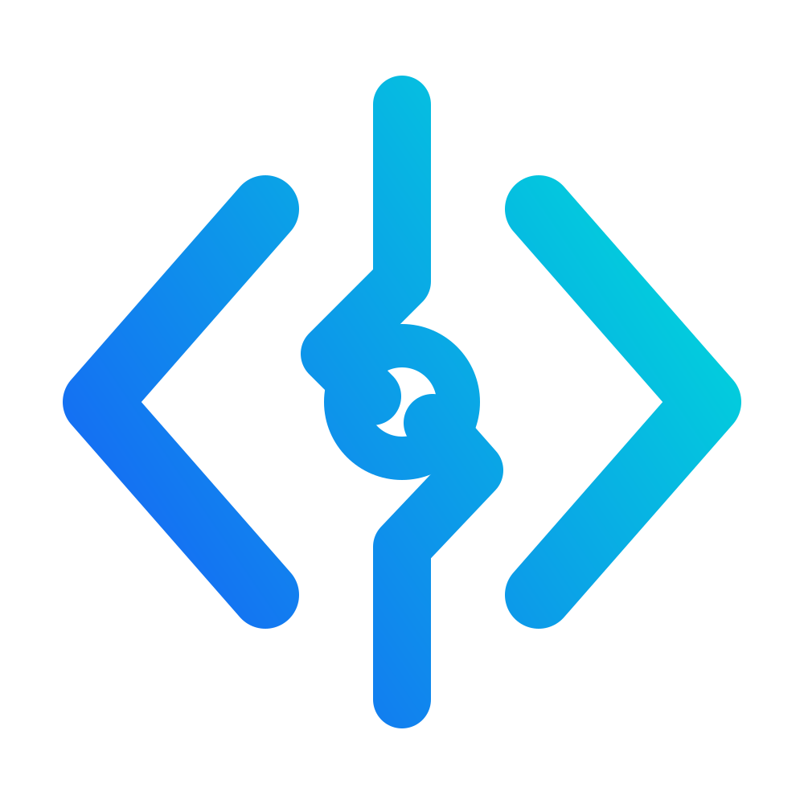

<p align="center">
  
</p>

<h1 align="center">Claude Codex Handoff</h1>

<p align="center">
  Delegate coding tasks from <a href="https://claude.com/claude-code">Claude Code</a> to the <a href="https://github.com/openai/codex">OpenAI Codex CLI</a> or <a href="https://opencode.ai">OpenCode</a> and get the results back.<br>
  Claude plans, Codex does the work.<br>
  Watch Codex, Claude and OpenCode sessions in the live dashboard (AI Live Viewer). The bundled fork of the official <code>codex</code> plugin keeps companion jobs alive through restarts and lets you resume or cancel them.<br>
  Works in the terminal and in VS Code.
</p>

<p align="center">
  <a href="../../releases/latest"></a>
  <a href="LICENSE"></a>
  
  = 22.13">
  
</p>

---

> [!WARNING]
> **Codex runs with full access by default.** Runs launched by this plugin use `danger-full-access`: Codex can read and write anywhere and run any command, as your user. This is deliberate. The sandboxed modes are broken on common Windows setups (Store PowerShell stub, error `1312`) and were a constant source of dead handoffs. Sandbox works on your machine? Set `CODEX_PLUGIN_SANDBOX=workspace-write` to get it back. Either way: only use this on machines you trust with the code you run.

## Install

```
/plugin marketplace add Fundryi/claude-codex-handoff
/plugin install codex@fundryi
```

Needs [Node.js](https://nodejs.org) 22.13+ and the Codex CLI (`npm install -g @openai/codex`, then `codex login`). Had the OpenAI-marketplace `codex` plugin? Uninstall it first; every `/codex:*` command name stays the same.

From your next Claude Code session on:

- the **dashboard starts itself** in the background (open it with `/codex:viewer`)
- the plugin **checks for updates** once a day and prints the update command when there is one

## Who this is for

- You work in Claude Code most of the time, in the terminal or the VS Code extension, and want Claude to delegate the heavy coding to Codex. Claude stays the orchestrator: it plans the work, writes the handoff, and checks what comes back.
- You want a second opinion. Codex reviews Claude's changes (`/codex:review`) or argues against a design (`/codex:adversarial-review`).
- You run long Codex jobs in the background and want to know when one is stuck, has failed, or waits for an answer.

## Why this exists

Handoffs to Codex run headless: no terminal, no window. When one silently died or hung, you found out an hour later, and there was no way to see why or continue it. This project makes the whole thing observable and recoverable.

## Compared with the official plugin

This is a fork of [openai/codex-plugin-cc](https://github.com/openai/codex-plugin-cc). The command names are the same, so you type the same commands after you switch. What is different:

- **Jobs survive restarts.** Every Codex run is detached from Claude. Restarting Claude Code or closing the chat does not end it.
- **Results come back by themselves.** Your next message to Claude brings back the result of each finished job, from any session in the same folder.
- **A live dashboard** shows every Codex session on the machine, marks jobs that are stuck or dead, and lets you resume or cancel them.
- **Better defaults.** Effort defaults to `xhigh`, you can set effort and fast mode per job, and short model names such as `sol` and `astra` work.
- **Full access by default,** because the sandbox breaks on many Windows setups. See the warning above.

## Never lose a job again

The dashboard classifies every job from ground truth (real PID + heartbeat), not from guessing at quiet log files:

| Status | Means | You do |
|---|---|---|
| Running | Heartbeat fresh, or the process is alive on a long command | Nothing. Long tasks are never misflagged. |
| Needs attention | Process gone before finishing, its heartbeat stopped, or it failed with a known cause | Click **Resume**, optionally with more effort or another model, or read the fix hint (broken sandbox, expired `codex login`, rate limit). |
| Needs answer | The finished job asked a question | Answer it in the result card; "Answer and resume" continues the same thread after a confirm. |
| Stopped | Cancelled job or aborted turn | Nothing. Not an alarm. |
| Finished | Completion event received | Read the result card: Summary, Changed files, Checks run. |

Recovery is always flag-only: the dashboard marks, you click. It never resumes or kills anything on its own. Job workers are detached and nothing ends them when a session ends, so restarting Claude Code, or sending a new message under a host like CloudCLI that ends the session per turn, doesn't kill your handoffs. The next prompt brings back a short result for each finished job: its Summary, any question Codex asks, and the job id for the full text.

On CloudCLI, where Claude always runs in one folder, `/codex:handoff --cwd <folder>` targets another project and its result still comes back to Claude's folder. Two limits: a resume started from the viewer is not reported through Claude's prompt hook (only a session in the job's own folder sees it), and `/codex:status` with no job id shows only the current folder's jobs (pass the id to see a `--cwd` job).

## What you get

**In Claude Code:**

| Command | Does |
|---|---|
| `/codex:handoff` | Hand a task to Codex, or to OpenCode with `--engine opencode`, as a background job (`/codex:rescue` is the same command under its original name) |
| `/codex:review` / `/codex:adversarial-review` | Codex reviews your working tree, or challenges your design |
| `/codex:status` / `/codex:result` / `/codex:cancel` | Track, fetch, or stop Codex and OpenCode jobs |
| `/codex:transfer` | Move the current Claude session into a Codex thread |
| `/codex:viewer [restart\|stop\|kill\|status]` | Open the dashboard (starts it, and replaces one left running by an older version); `restart`, `stop`, force-quit (`kill`) or `status` it |
| `/codex:setup` | Check Codex CLI readiness (OpenCode needs no setup command) |

**Effort and fast mode** are set per job (the Resume form in the dashboard, `--effort`/`--fast` on the CLI, or just say "high effort" / "use fast mode" in a handoff request):

| Effort | Use for |
|---|---|
| `low` | Trivial one-liners, mechanical renames, boilerplate |
| `medium` | Quick tweaks; simple browser-testing checklists |
| `high` | Browser testing and live verification runs, larger mechanical work |
| `xhigh` | The everyday default: bugfixes, features, reviews, designs, root-cause hunts |
| `max` | The hardest problems (GPT-6.1, GPT-6, GPT-5.6, and Daybreak models) |
| `ultra` | Max reasoning plus automatic task delegation (`gpt-6.1-sol`, `gpt-6-astra`, `gpt-6-sol`, `gpt-5.6-sol`, `gpt-5.6-terra`, `gpt-daybreak-blue-latest`; the Luna models stop at `max`) |

When in doubt, go one tier up. A smarter run costs a little more time and quota; a dumber run costs a redo. If you set no effort, the plugin applies `xhigh` instead of Codex's own low default. `/codex:review` is the exception: it takes no `--effort` (Codex's review request has no effort field) and runs at the effort in your Codex config; `/codex:adversarial-review` takes `--effort`. `max` and `ultra` are never applied on their own; ask for them.

**Model shortcuts:** `--model astra`, `sol`, `terra`, `luna`, and `daybreak-blue` expand to `gpt-6-astra`, `gpt-6.1-sol`, `gpt-5.6-terra`, `gpt-6-luna`, and `gpt-daybreak-blue-latest`. There is no GPT-6 Terra, so `terra` stays on GPT-5.6. Pass a full name such as `gpt-6-sol` or `gpt-5.6-sol` to pick an older model. Leave the model unset to get the default from your Codex config; without a model in the config, Codex uses its catalog default, `gpt-6.1-sol` (since Codex 0.159.1). `astra` is GPT-6 Astra, the most capable model. A `--model` that Codex has scheduled for retirement still runs. Handoffs and `/codex:adversarial-review` then put a warning with the retirement date and the model Codex suggests on the first line of the result and in the job log. `/codex:review` gives no warning. The effort table above says which models take `max` and `ultra`.

`daybreak-blue` is Daybreak Blue, the security-specialty model: sol-class reasoning with fewer restrictions on defensive security analysis. Use it for security reviews, audits, vulnerability hunting, and reversing work. Daybreak access is verification-gated per account, so the plugin checks availability before starting a Daybreak run; without access the run fails immediately with a clear message instead of an opaque API error.

`--fast` is orthogonal: it buys the `priority` service tier (faster turnaround, more quota; the Codex catalog lists about 2x speed on `gpt-6.1-sol` and `gpt-6-astra`, 1.5x on most other models) at whatever effort you chose, and never changes the effort tier. Use it when you are actively waiting on the result; it is always opt-in, never the default.

**In the browser** (`localhost:8377`):

- one tree of all work, grouped by project: Claude chats with their subagents, workflow runs and Codex handoffs, Codex sessions and agents, and recent OpenCode chats with their child sessions. Two tabs (Live, History), status chips, and Claude, Codex and OpenCode kind chips
- a feed that shows who says what: your messages, Claude's handoff prompts and automatic answers, the plugin's return format, Codex's replies and questions, and Codex's work (thinking, commands, patches) in its own collapsed log, each actor in one color with a legend
- a result card on every finished handoff (Summary, Changed files, Checks run, Needs decision) with an answer box that resumes the thread when Codex asked a question; "Show full result" opens the full result dialog and lists every run on the thread, newest first
- a Claude chat opens with its live transcript (your prompts, Claude's replies and work); a Claude subagent or workflow agent opens in a side panel next to it; a workflow groups its agents by topic, with the phase steps of each topic. Claude work uses the Claude orange, Codex work teal. The viewer only reads the files under `~/.claude/projects` and has no stop or resume buttons for Claude
- token usage on every row and tree, split by source, and your plan limits at the bottom of the sidebar, as the part already used: the Codex limits read live every 5 minutes with the count of free limit resets you have, and the Claude 5-hour and weekly limits, updated after each Claude reply when you turn on the plugin's status line (see "Claude limits that stay current" below), else from the snapshot Claude Code saves when you open `/usage`
- one-click resume and cancel, with in-app confirmation
- one job store shared with the CLI, so `/codex:status` and the dashboard always agree
- search across all recorded sessions, effort/sandbox/token display, archived sessions, unread markers, saved layout

## OpenCode sessions

AI Live Viewer shows recent OpenCode TUI chats, `opencode run` sessions and child sessions in the project tree. Open a session to read its messages, reasoning, tool output, model, token counts and cost in the shared feed. Children sit under their parent. The viewer uses OpenCode idle records and update times for status. Tracked OpenCode tasks have Resume and Cancel controls. Other OpenCode sessions are read only.

## Hand off to OpenCode

Install OpenCode 2.0 or newer (`npm install -g @opencode/cli`) and run `opencode` once to set it up. OpenCode 1.x does not work: the handoff needs the `--standalone` option of OpenCode 2. Then use:

```text
/codex:handoff --engine opencode Explain the retry logic. Do not edit files.
/codex:handoff --engine opencode --model provider/model#variant Fix the retry logic.
```

The companion runs OpenCode as a detached job with its own process. Status, result, cancel and prompt-hook delivery work the same way as for Codex. Resume with `--resume` or `--resume-thread <ses_id>`. The [runtime skill](plugin/skills/codex-cli-runtime/SKILL.md) owns the engine, model, variant and write rules.

Every OpenCode run uses the `build` agent with `--standalone --auto` for full permission, like Codex's `danger-full-access` default. `--write` is a job label only and enables the review hint. For read-only intent, put "do not edit files" in the handoff rules.

The database is read only. The viewer reads only `session_v2` and `session_message`. It does not read account or credential tables. A read-only WAL connection can touch the `-shm` file. Transcripts use the same trusted-origin gate as Claude transcripts.

Set `OPENCODE_DB` to use a different database. The default is `$XDG_DATA_HOME/opencode/opencode.db` when `XDG_DATA_HOME` is set, else `~/.local/share/opencode/opencode.db`, on Windows too. The viewer reads OpenCode 2 sessions only. If the file, its OpenCode 2 tables or built-in SQLite support is missing, this source is off. The list uses the Claude 24-hour window: the 30 most recent roots plus every root with running work. A recent child keeps its parent in the window.

## Using it well

Patterns from daily use that make handoffs reliable:

1. **Write a contract, not an essay.** Keep short per-task-type instruction files in your repo and open every prompt with the line `Follow handoff/coding.md (binding).` on its own, then the task as `<goal>`, `<rules>`, `<done_when>` and `<files>`. A ready-to-copy set ships in [`handoff/`](handoff/): copy the folder, fill in the `ADAPT:` markers, done. The plugin spots contract files and names the right one automatically.
2. **Scope limits writes, not reads.** Codex may read anything to trace the real flow; name the files it may change.
3. **Demand a self-check gate.** End your contract with checks Codex runs before returning. Every bug a review catches becomes a permanent check, so quality compounds.
4. **Fix a return format.** Uniform returns (findings, diff, manifest, gate results) are reviewable at a glance. The plugin ends every task with Summary, Changed files, Checks run and Needs decision; your contract's sections come before those.
5. **Match effort to the task, and round up.** `xhigh` for everything that involves judgment; `medium`/`high` fit verification runs like browser testing, where the checklist does the thinking. `--fast` only when you're actively waiting.
6. **Let the dashboard carry the anxiety.** Kick off jobs, keep working, act when a badge asks you to.

<details>
<summary><b>Claude limits that stay current</b> (one setting)</summary>

Claude Code saves its usage numbers only when you open `/usage`. To keep the dashboard's Claude 5-hour and weekly limits current, turn on the status line that the plugin ships. Claude Code hands every status line your limits after each reply. The script prints them at the bottom of the chat and saves them for the dashboard.

A plugin cannot turn on a status line by itself, so add this to `~/.claude/settings.json` once (use your own home folder):

```json
"statusLine": {
  "type": "command",
  "command": "node \"C:/Users/<you>/.codex-companion/claude-statusline.mjs\""
}
```

The plugin copies the script to `~/.codex-companion/claude-statusline.mjs` at each session start, so the path stays the same after plugin updates. One run takes about 50 ms after a reply and costs no tokens. Limits show only for claude.ai Pro and Max plans. Confirmed in the terminal CLI; not yet confirmed in the VS Code extension. If you already have a status line, keep yours: the dashboard then uses the `/usage` snapshot.

</details>

<details>
<summary><b>Standalone dashboard</b> (no plugin needed)</summary>

The dashboard runs on its own. It reads Codex, Claude and OpenCode sessions:

```sh
node ai-live-viewer.js start    # background + open browser (add --no-open to skip the tab)
node ai-live-viewer.js serve    # foreground
node ai-live-viewer.js stop
node ai-live-viewer.js restart  # stop whatever viewer runs, start this one
node ai-live-viewer.js status   # running or not, and its version
node ai-live-viewer.js kill     # force-quit, also a hung viewer
```

`start` replaces a viewer left running by an older version, so after an update it brings up the new one.

**Port and address.** The viewer listens on `127.0.0.1:8377`. The port is fixed on purpose: the plugin finds the viewer by it to report finished jobs. If another program already uses 8377, the viewer does not start and says so; set `CODEX_VIEWER_PORT` to a free port where Claude and Codex run. Under WSL, `localhost:8377` on Windows reaches a viewer running inside WSL, and it shows the Codex runs from the WSL side. In a Docker container, set `CODEX_VIEWER_HOST=0.0.0.0` and publish the port to the host only, for example `-p 127.0.0.1:8377:8377`.

The viewer shows no desktop pop-ups. Use the Node CLI or the plugin's autostart to run it. Releases have no zip assets. The plugin installs from the marketplace.

### Integrations

The viewer reads Codex rollouts without setup, a plugin or hook trust. It shows no desktop pop-ups. The optional Codex hook and OpenCode plugin only make the viewer refresh sooner. The integrations use the same files on Windows, macOS and Linux.

Run `/codex:setup` to check the optional Codex hook and manage the OpenCode viewer plugin. The Codex PermissionRequest hook ships inside `codex@fundryi`, separate from the Claude hooks. It requests an earlier refresh when Codex asks for approval. It runs synchronously with a 3-second hook timeout and a 1.5-second HTTP timeout. Codex substitutes the plugin path before it runs the command, so the command does not depend on shell variables or plugin versions.

For earlier refreshes on approval requests, install the plugin in Codex and do this once: **open codex, run /hooks, trust the codex@fundryi hooks**. Approval requests occur only when Codex's approval policy is not `never`. Setup reports trusted or needs trust. It reads the saved trust but never edits Codex config.

For OpenCode 2, setup asks before it copies `ai-live-viewer-notify.js` into the global `opencode/plugins/` config folder. The plugin requests an earlier refresh when a turn ends or OpenCode asks for approval or an answer. It respects `XDG_CONFIG_HOME` and `OPENCODE_CONFIG_DIR`. Restart OpenCode after installation. Use `/codex:setup --remove-opencode-plugin` to remove the file. Setup removes only a file with our plugin id marker. It never edits `opencode.json`.

Companion job reports refresh the job list through the viewer's event stream.

Old Windows `.bat` installs are left as they are. Setup reports a legacy `notify.ps1` setting and does not change it.

Remote access: `--host 0.0.0.0` (or `CODEX_VIEWER_HOST=0.0.0.0`, which the plugin's autostart also uses) for your LAN, with no token, so anyone on that network can use it; `--tunnel` for a free Cloudflare quick tunnel (token-gated, URL printed on start), `--tunnel-token <t>` for a named tunnel on your own domain. Local access never needs a token.

Behind a reverse proxy (Nginx Proxy Manager, Caddy, Traefik): set `CODEX_VIEWER_ALLOWED_HOSTS` to the name you open in the browser, for example `viewer.example.com`. Put it in the `env` block of `~/.claude/settings.json` on the machine that runs the viewer, so the autostart uses it too. That one setting also makes the viewer listen on all addresses, because the proxy usually runs on another machine. If the proxy runs on the same machine, also set `CODEX_VIEWER_HOST=127.0.0.1`. Without the name, the page loads but every control is refused, and the header says "Controls blocked at this address". The proxy needs no special settings: the viewer sends a keep-alive line every 25 seconds, so live updates do not time out. Like LAN access, there is no token, so protect the proxy name if others can reach it.

Claude transcripts (chats, subagents and workflow agents) can hold text from every project on the machine. The viewer treats them like Codex jobs: every link that can use the controls can read them, so the `localhost` link, the tunnel link and a declared proxy name. A page from another site cannot. Chat titles, states, models and token counts show on every link, as Codex session titles do. If anyone on your network can reach a LAN bind (`--host 0.0.0.0`), they can read your Claude chats too. Use the tunnel or a proxy with a login in that case.

</details>

<details>
<summary><b>Configuration</b> (environment variables)</summary>

| Variable | Default | Purpose |
|---|---|---|
| `CODEX_PLUGIN_SANDBOX` | `danger-full-access` | Sandbox for plugin/dashboard-launched runs (see warning above) |
| `CODEX_PLUGIN_FAST_TIER` | `priority` | Service tier used by `--fast` |
| `CODEX_PLUGIN_UPDATE_CHECK` | `1` | `0` disables the daily update check |
| `CODEX_VIEWER_AUTOSTART` | `1` | `0` disables the session-start dashboard autostart |
| `CODEX_VIEWER_PORT` | `8377` | Dashboard port (also receives job-completion pushes) |
| `CODEX_VIEWER_HOST` | `127.0.0.1` | Bind address; `0.0.0.0` opens it to your LAN |
| `CODEX_VIEWER_ALLOWED_HOSTS` | (none) | Comma list of names a reverse proxy serves the dashboard under; when set, the default bind becomes `0.0.0.0` |
| `CODEX_COMPANION_STATE_ROOT` | `~/.codex-companion/state` | Shared job state (CLI + dashboard) |
| `CODEX_HOME` | `~/.codex` | Where Codex session files are read from |
| `CLAUDE_CONFIG_DIR` | `~/.claude` | Where Claude workflow runs are read from (its `projects` folder) |
| `OPENCODE_DB` | `$XDG_DATA_HOME/opencode/opencode.db` or `~/.local/share/opencode/opencode.db` | OpenCode database, read only |

</details>

<details>
<summary><b>Project layout</b></summary>

- `ai-live-viewer.js`: CLI and server startup
- `server/`: CommonJS modules for sessions, jobs, transcripts, access, HTTP and usage. See the server file map in [AGENTS.md](AGENTS.md). Node standard library only, no build step
- `ui/`: markup in `index.html`, six CSS files and 19 classic scripts in `js/`. Keep the fixed load order. No ES modules, bundler or build step. See the UI file map in [AGENTS.md](AGENTS.md)
- `plugin/`: the Claude Code plugin, forked from [openai/codex-plugin-cc](https://github.com/openai/codex-plugin-cc) (keeps OpenAI's Apache-2.0 `LICENSE` and `NOTICE`; the changes fall under the root [LICENSE](LICENSE))
- `plugin/.codex-plugin/plugin.json`: the manifest Codex reads when the plugin is installed there. It points at `codex-hooks/hooks.json` for the optional approval hook (it makes the viewer refresh sooner) and keeps the Claude hooks out of Codex. Keep its version equal to `plugin/.claude-plugin/plugin.json`
- `plugin/viewer/`: copies of the entry, logo and complete `server/` and `ui/` trees. Refresh with `npm run sync:viewer`. Tests check for drift
- `handoff/`: ready-to-copy handoff contract templates
- `scripts/upstream-diff.mjs`: diff `plugin/` against upstream for selective, manual cherry-picks
- `tests/`: zero-dependency `node:test` suites

A complete viewer install needs `ai-live-viewer.js`, the sibling `server/` and `ui/` trees, and `assets/logo.svg`. Missing required UI assets fail startup. There is no embedded fallback page. Keep the companion files under `plugin/` for Resume and Cancel.

</details>

## Security notes

- Listens on `127.0.0.1` by default. State-changing endpoints are POST-only, origin-guarded, and confirmed in-app.
- Never edits Codex session files or `~/.codex`. It spawns Codex only through the bundled companion, and only when you act.
- The convenience came from dropping the sandbox. That is a real decision, not a default to forget about.

## Contributing

Issues and pull requests are welcome. Read [CONTRIBUTING.md](CONTRIBUTING.md) first. For questions, use [Discussions](../../discussions).

## License

[Apache 2.0 with the Commons Clause](LICENSE). You may use, change, fork and share this project, also at work, and publish your own better version. You may not sell it, or sell a service that is built mainly on it.

The plugin started as [openai/codex-plugin-cc](https://github.com/openai/codex-plugin-cc). Code that comes unchanged from there stays under OpenAI's plain Apache 2.0 license. The plugin in releases up to v2.17.0 was published under plain Apache 2.0, and those copies keep that license.
